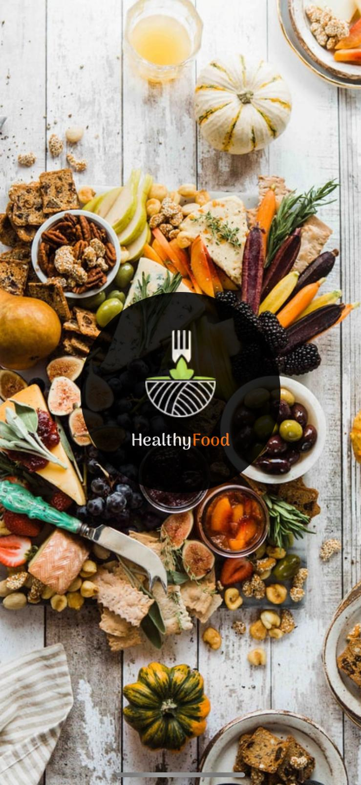
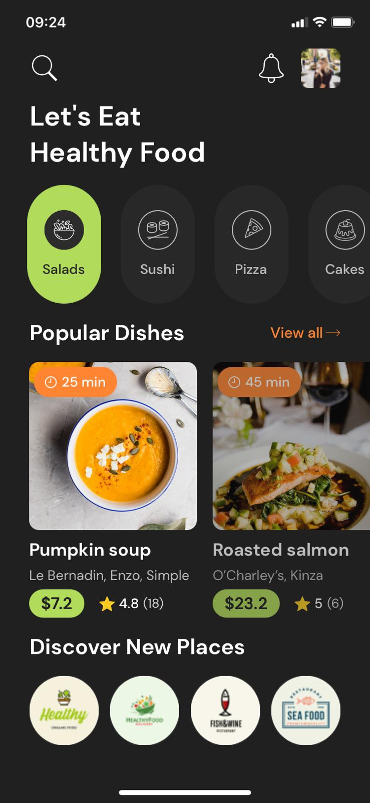
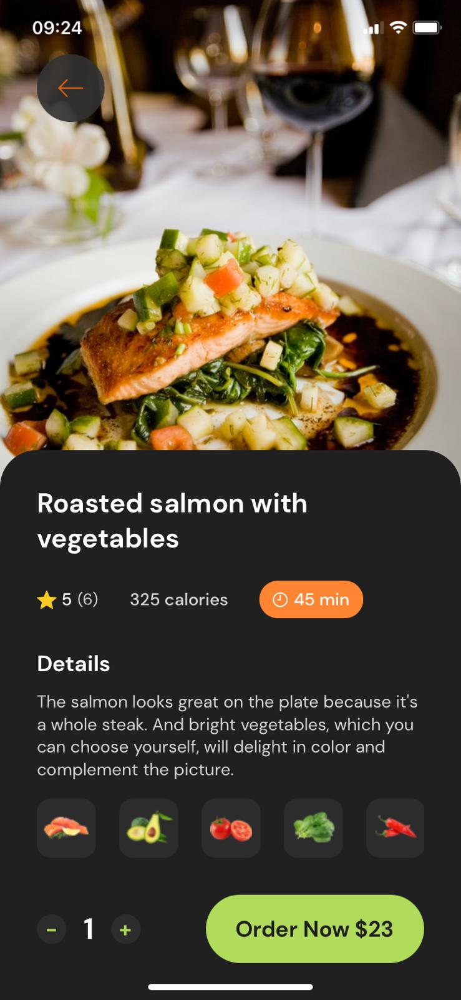
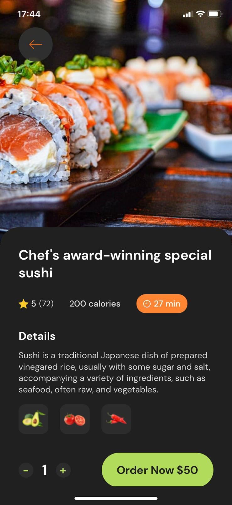

# Food Delivery Mobile App Concept

Food Delivery Mobile App Concept using React Native and Expo.

### Screenshots

| Loading Screen                                               | Main Screen                                               |
| ------------------------------------------------------------ | --------------------------------------------------------- |
|  |  |

 

| Card Screen                                                 | Card Screen 2                                               |
| ----------------------------------------------------------- | ----------------------------------------------------------- |
|  |  |

### Installation

This repository requires [Node.js](https://nodejs.org/) and [Yarn](https://yarnpkg.com/) or [npm](https://www.npmjs.com/) to run.

#### `yarn install`

### Development

#### `yarn start`

Runs the app in development mode. Open it in the [Expo app](https://expo.io) on your phone to view it. It will reload if you save edits to your files, and you will see build errors and logs in the terminal.

### iOS

#### `yarn ios`

Like yarn start, but also attempts to open your app in the iOS Simulator if you're on a Mac and have it installed.

### Android

#### `yarn android`

Like yarn start, but also attempts to open your app on a connected Android device or emulator.

### TODO
* [x] Add screenshots
* [ ] Add gifs
* [ ] Better StyleSheet organization
* [ ] Better Type organization

### Design

This [beautiful design](https://dribbble.com/shots/15117047-Food-Delivery-app-Dark-mode-Design) made by [Alesya Kosovich](https://dribbble.com/ales_kch) and I especially thanks to her for letting use her design.

### Photos

Background photo is taken by [@brookelark](https://unsplash.com/photos/RrzeCGujVfU)

Pumpkin Soup photo is taken by [@calajay](https://unsplash.com/photos/w6ftFbPCs9I)

Salmon photo is taken by [@simplethemes](https://unsplash.com/photos/awj7sRviVXo)

Sushi photo is taken by [@viniciusbenedit](https://unsplash.com/photos/-1GEAA8q3wk)

### Contributing

Pull requests are welcome. For major changes, please open an issue first to discuss what you would like to change.

### License

[MIT](https://choosealicense.com/licenses/mit/)
